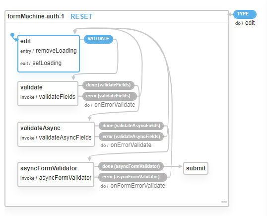
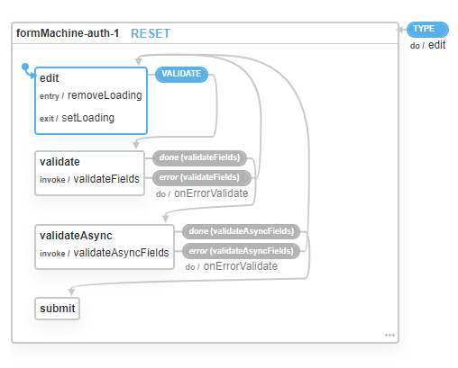

# xFormState

Управление состоянием формы с помощью xstate.

1. синхронная валидация одного поля (пример — минимальная длина поля)
1. асинхронная валидация одного поля (пример — проверка на сервере занято ли имя пользователя)
1. синхронная валидация всей формы, ошибка присваивается конкретному полю (пример: пароль — повторение пароля)
1. асинхронная валидация всей формы, ошибка присваивается конкретному полю (пример: предварительная проверка — извините,
   ваш тариф не позволяет создание такого количества узлов)
1. асинхронная валидация всей формы, ошибка присваивается всей форме

Пункты 2, 3, и 4 реализованы с помощью `asyncFormValidator, asyncValidator`.

## Описание



Машина имеет 5 состояний _(edit, validate, validateAsync, asyncFormValidator, submit)_.

* **edit** - состояние, в котором машина будет находиться больше всего времени, так как оно **"основное"**. В нем
  происходит редактирование формы.
* **validate, validateAsync, asyncFormValidator** - являются **"проходными"** состояниями, при вхождении в эти состояния
  сразу запускаются guard'ы проверки полей и определяется переход на следующее состояние.  
  Если `asyncValidator` функция ни разу не встретится в `rules` _(см. API)_, то машина построится без **validateAsync**
  состояния. Аналогично для функции `asyncFormValidator` и состояния **asyncFormValidator**.
 
 Из природы их существования видно что проверки в **validateAsync**, не будут вызваны если **validate** провалится, то
  же самое и для **asyncFormValidator**.  
  _(Про работу проверок смотри API)_
* **submit** - так же является **"проходным"** состоянием, которое срабатывает при прохождении всех валидаций и сразу
  переходит в состояние **edit** и вызывает `submitForm` callback.

При создании машины формируется контекст в таком [виде](https://github.com/boldevelop/xformstate/blob/master/src/xformstate/machine/index.js#L115):
```ts
{
  context: {
    fieldName1: {
      value: initialValue || '';
      error: '';        
    }
    fieldName2: {
      value: initialValue || '';
      error: '';
    }
    // ...
  }   
}
```
Далее в зависимости от прохождения состояний валидации в `error` у `fieldName1` сетится ошибка.
При редактировании формы после не удачной валидации, у редактируемого поля ошибка 
[очистится](https://github.com/boldevelop/xformstate/blob/master/src/xformstate/machine/index.js#L284).
В нахождении **"проходных"** состояний форма имеет активное состояние у `loading`.

## API

За построение машина отвечает функция [xFormMachine](./src/xformstate/machine/index.js).  
Интеграция с react происходит через банальный хук [useXFormState](./src/xformstate-react/index.js).  
Сигнатуры у функций одна и та же `(id, fieldsOptions, formOptions)`, отличие в возвращаемых значениях
`xFormMachine` - вернет инстанс xstate, когда `useXFormState` - вернет кортеж из `[fields, formMeta]`.

```ts
type FieldName = string;
type Value = string;

type ContextForm = Record<FieldName, Value>;

type FormMeta = {
  clearFields: () => void;
  onSubmit: () => void;
  error: string;
  loading: boolean;
}

type FieldData = {
    onChange: (value: Value) => void;
    value: Value;
    error: string;
}

type Fields = Record<FieldName, FieldData>;

type Rule = {
    validator?: (value: Value, contextForm: ContextForm) => boolean;
    asyncValidator?: (value: Value, contextForm: ContextForm) => Promise<void>;
    error: string;
}

type FieldOptions = {
    name: FieldName;
    initialValue?: Value;
    rules?: Rule[];
}

type FormOptions = {
  asyncFormValidator: (contextForm: ContextForm) => Promise<void>;
  submitForm: (contextForm: ContextForm) => void;
}

declare function useXFormState(id: string, fieldOptions: FieldOptions[], formOptions: FormOptions): [Fields, FormMeta];


```

`id` - айди формы/машины  
`fieldOptions` - массив описания полей формы, где
* `name` - имя поля, которое будет ассоциироваться со значением поля.
 То есть будет возвращаться в `Fields` и использоваться в `ContextForm`. Должно быть валидным свойством js объекта
* `initialValue` - начальное значение поля. _(При вызове метода `clearFields` из `FormMeta`,
  значение у поля установится в `''`, даже если задано `initialValue`)_
* `rules` - массив валидаторов поля.  
  В котором `validator` и `asyncValidator` являются необязательными параметрами, то есть можно задать одного из
  них или оба. Причем `validator` и `asyncValidator` попадут в разные состояния машины **validate и validateAsync** 
  соответственно.  
  **Особенности работы**  
  В состоянии **validate**, для _каждого_ поля _последовательно_ применяются `validator`
  из массива `rules`, если один из `validator` провалится, присваивается ошибка полю
  _(значение ошибки берется из `error`)_, после проверка переключается на следующее поле.  
  в состоянии **validateAsync**, если же хоть один `asyncValidator` упадет или выбросит исключение,
  валидация заканчивается и для поля присваивается ошибка выброшенная из `asyncValidator` или `Promise.reject`'нутая.  
  **Недостатки**  
  Нужно строго определять порядок в массиве `rules` для `validator`. Если нужно сделать поле обязательным - `validator`
  на это условие должен идти самым первым [смотри Sample1](./src/components/Sample1.js)

`formOptions.asyncFormValidator` - валидатор формы, который вызывается в состоянии **asyncFormValidator**
при неудачном завершении (выброшенная ошибка с текстом или `Promise.reject`'нутая) попадает в `FormMeta.error`   
`formOptions.submitForm` - callback вызываемый в состоянии **submit**.

`Fields` - является `record` типом данных, где ключом является имя поля, которое задавалось в `fieldOptions.name`,
а значение содержит объект с полями
* `onChange` - колбэк который нужно вызываться для изменения значения поля.
* `value` - текущее значение поля
* `error` - ошибка поля

`FormMeta` - объект данного типа содержит методы по работе с формой и её состояние.
* `clearFields` - метод очищающий все поля
* `onSubmit` - метод который нужно вызывать, чтоб запустить валидацию формы
* `error` - ошибка поля полученная с `formOptions.asyncFormValidator`
* `loading` - булево значение, которое активно при прохождении состояний **validate, validateAsync, asyncFormValidator**


## Использование
[Примеры](./src/App.js)
```bash
npm i
npm run start
```

## Ограничение
Во время валидаций так как происходит асинхронные проверки, блокирую изменения контекста (инпуты нельзя изменить во время валидации). Так сделано чтоб не изменять валидируемые данные от первоначально отправленных между асинхронными запросами.

В данной версии реализовано только для текстовых полей, но думаю можно и добавить для других типов
Из недостатков: метод `clearFields` очищает поля, но и полям присваиваются ошибки. Но это думаю можно исправить.
Так же нет возможности присвоить сразу нескольким полям значения, но это тоже можно реализовать через отдельный экшн.

## Альтернативное решение
Не использовать context и под каждое поле создавать стековую машину, получится 
гибче настройка мне кажется, но мне показалось это сложным.
